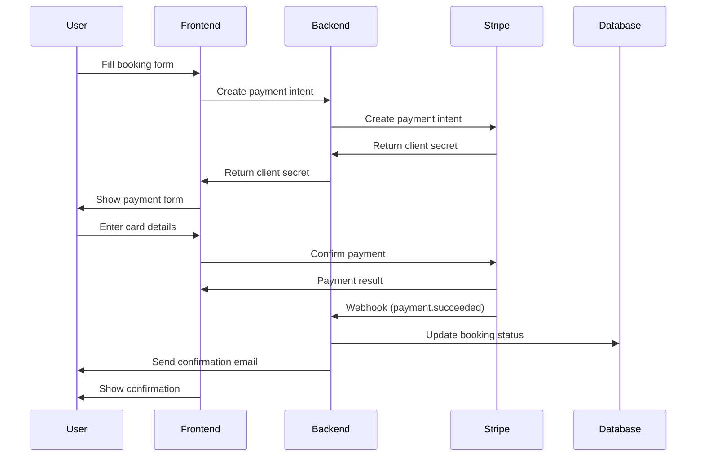

# Stripe Payment Integration Guide

This guide provides a comprehensive overview of Stripe integration in a TypeScript/Lit project using Firebase and Netlify Functions. The architecture separates frontend payment collection from backend payment processing for security and reliability.

## Table of Contents

1. [Architecture Overview](#architecture-overview)
2. [Prerequisites](#prerequisites)
3. [Environment Configuration](#environment-configuration)
4. [Frontend Implementation](#frontend-implementation)
5. [Backend Implementation](#backend-implementation)
6. [Payment Flow](#payment-flow)
7. [Error Handling & Recovery](#error-handling--recovery)
8. [Webhook Integration](#webhook-integration)
9. [Testing](#testing)
10. [Security Considerations](#security-considerations)

## Architecture Overview

The payment system consists of:

- **Frontend**: Lit components with Stripe Elements for secure payment collection
- **Backend**: Netlify Functions for payment intent creation and webhook handling
- **Database**: Firebase Firestore for booking and payment records
- **Payment Processing**: Stripe for secure payment processing

```
┌─────────────────┐     ┌─────────────────┐     ┌─────────────────┐
│   Frontend      │────▶│   Backend API   │────▶│     Stripe      │
│  (Lit + RxJS)   │◀────│(Netlify Funcs)  │◀────│      API        │
└─────────────────┘     └─────────────────┘     └─────────────────┘
         │                       │                         │
         └───────────────────────┴─────────────────────────┘
                                 │
                         ┌───────▼────────┐
                         │   Firestore    │
                         │   Database     │
                         └────────────────┘
```

## Prerequisites

- Node.js 16+
- TypeScript 4.5+
- Lit 2.0+
- RxJS 7+
- Firebase Admin SDK
- Stripe account with API keys
- Netlify CLI for local development

## Environment Configuration

### Frontend Environment Variables

Create `.env` files for development and production:

```bash
# .env.development
VITE_BASE_URL=http://localhost:8888/
VITE_STRIPE_PUBLISHABLE_KEY=pk_test_...

# .env.production
VITE_STRIPE_PUBLISHABLE_KEY=pk_live_...
```

### Backend Environment Variables

Set in Netlify environment or `.env` file:

```bash
STRIPE_SECRET_KEY=sk_test_... # or sk_live_... for production
STRIPE_WEBHOOK_SECRET=whsec_...
```

## Frontend Implementation

### 1. Stripe Initialization (`src/public/stripe.ts`)

```typescript
import { Appearance, Stripe, StripeElements, loadStripe } from '@stripe/stripe-js'
import { BehaviorSubject, from, map, switchMap } from 'rxjs'

// Use environment-specific keys
export const PUBLISHABLE_KEY = import.meta.env.DEV
  ? 'pk_test_...'
  : 'pk_live_...'

// Initialize Stripe
export const stripePromise: Promise<Stripe | null> = loadStripe(PUBLISHABLE_KEY, { locale: 'auto' })

// Observable for Stripe Elements
export const $stripeElements = new BehaviorSubject<StripeElements | undefined>(undefined)

// Function to create payment intent
export function createPaymentIntent(body: any) {
  return from(
    fetch(
      ((import.meta.env.DEV ? import.meta.env.VITE_BASE_URL : '/')) + 'api/create-payment-intent',
      {
        method: 'POST',
        headers: { 'Content-Type': 'application/json' },
        body: JSON.stringify(body),
      }
    )
  ).pipe(
    switchMap(res => {
      if (!res.ok) {
        return res.json().catch(() => ({
          error: `Payment failed: ${res.status} ${res.statusText}`
        }))
      }
      return res.json()
    }),
    map(responseBody => {
      if (responseBody.error) {
        throw new Error(responseBody.error)
      }
      return responseBody as { clientSecret: string; paymentIntentId: string }
    })
  )
}

// Stripe appearance configuration
export function appearance(): Appearance {
  return {
    theme: 'stripe',
    variables: {
      colorPrimary: '#007bff',
      borderRadius: '8px',
      fontFamily: 'system-ui',
    }
  }
}
```

### 2. Payment Service (`src/public/book/payment-service.ts`)

```typescript
import { Stripe, StripeElements } from '@stripe/stripe-js'
import { BehaviorSubject, from, Observable, of } from 'rxjs'
import { catchError, finalize, map, switchMap, tap } from 'rxjs/operators'

export class PaymentService {
  private _processing = new BehaviorSubject<boolean>(false)
  
  get processing$(): Observable<boolean> {
    return this._processing.asObservable()
  }

  processPayment(
    booking: Booking,
    stripe: Stripe,
    elements: StripeElements
  ): Observable<{ success: boolean; booking: Booking; error?: any }> {
    this._processing.next(true)

    const paymentData = {
      amount: Math.round(booking.price * 100), // Convert to cents
      currency: 'eur',
      email: booking.customerEmail,
      name: booking.userName,
      // Include all relevant metadata for webhook processing
      bookingId: booking.id,
      courtId: booking.courtId,
      date: booking.date,
      startTime: booking.startTime,
      endTime: booking.endTime,
    }

    return from(createPaymentIntent(paymentData)).pipe(
      switchMap(response => {
        const clientSecret = response.clientSecret
        
        return from(stripe.confirmPayment({
          clientSecret,
          elements,
          confirmParams: {
            return_url: `${window.location.origin}/booking/confirmation?booking=${booking.id}`,
          },
          redirect: 'if_required',
        }))
      }),
      map(result => {
        if (result.error) {
          throw result.error
        }
        return { success: true, booking }
      }),
      catchError(error => {
        console.error('Payment error:', error)
        return of({ success: false, booking, error })
      }),
      finalize(() => this._processing.next(false))
    )
  }
}
```

### 3. Payment Component (`src/public/book/components/steps/payment-step.ts`)

```typescript
import { $LitElement } from '@mhmo91/schmancy/dist/mixins'
import { html } from 'lit'
import { customElement, property, state } from 'lit/decorators.js'
import { Stripe, StripeElements } from '@stripe/stripe-js'
import stripePromise, { $stripeElements } from 'src/public/stripe'

@customElement('payment-step')
export class PaymentStep extends $LitElement() {
  @property({ type: Object }) booking!: Booking
  @state() processing = false
  @state() formValidity: Record<string, boolean> = {}
  
  private stripe: Stripe | null = null
  private elements?: StripeElements
  private paymentService = new PaymentService()

  async connectedCallback() {
    super.connectedCallback()
    await this.initializeStripe()
  }

  private async initializeStripe() {
    this.stripe = await stripePromise
    
    if (!this.stripe) return
    
    // Subscribe to elements
    $stripeElements.subscribe(elements => {
      this.elements = elements
    })
  }

  async processPayment(e: Event) {
    e.preventDefault()
    
    if (!this.validateForm() || !this.stripe || !this.elements) {
      return
    }

    // Validate Stripe elements
    const { error } = await this.elements.submit()
    if (error) return

    this.paymentService.processPayment(
      this.booking, 
      this.stripe, 
      this.elements
    ).subscribe(result => {
      if (result.success) {
        // Navigate to confirmation
        this.dispatchEvent(new CustomEvent('booking-complete', {
          detail: { booking: result.booking },
          bubbles: true,
        }))
      }
    })
  }

  render() {
    return html`
      <schmancy-form @submit=${this.processPayment}>
        <!-- Customer information inputs -->
        <sch-input
          .value=${this.booking.userName}
          required
          placeholder="Full Name"
          @change=${(e: any) => this.updateBooking('userName', e.detail.value)}
        ></sch-input>
        
        <sch-input
          type="email"
          .value=${this.booking.customerEmail}
          required
          placeholder="Email"
          @change=${(e: any) => this.updateBooking('customerEmail', e.detail.value)}
        ></sch-input>

        <!-- Stripe Payment Element -->
        <slot name="stripe-element"></slot>

        <schmancy-button type="submit" ?disabled=${this.processing}>
          Pay €${this.booking.price.toFixed(2)}
        </schmancy-button>
      </schmancy-form>
    `
  }
}
```

### 4. Reusable Stripe Component (`src/schmancy/stripe-payment.ts`)

```typescript
import { $LitElement } from '@mhmo91/schmancy/dist/mixins'
import { customElement, property, state } from 'lit/decorators.js'
import { loadStripe, Stripe, StripeElements } from '@stripe/stripe-js'

@customElement('schmancy-stripe-payment')
export class SchmancyStripePayment extends $LitElement() {
  @property({ type: Object }) config!: StripePaymentConfig
  @property({ type: String }) clientSecret?: string
  @state() private processing = false
  
  private stripe: Stripe | null = null
  private elements?: StripeElements
  private paymentElement: any = null

  async connectedCallback() {
    super.connectedCallback()
    await this.initializeStripe()
  }

  private async initializeStripe() {
    this.stripe = await loadStripe(this.config.publishableKey, {
      locale: this.config.locale as any
    })
    
    if (!this.stripe) return

    // Create elements
    if (this.clientSecret) {
      this.elements = this.stripe.elements({
        clientSecret: this.clientSecret,
        appearance: this.config.appearance
      })
    } else {
      this.elements = this.stripe.elements({
        mode: 'payment',
        amount: this.config.amount!,
        currency: this.config.currency!,
        appearance: this.config.appearance
      })
    }

    // Create and mount payment element
    this.paymentElement = this.elements.create('payment', {
      layout: 'tabs'
    })
    
    const container = this.shadowRoot?.querySelector('#payment-element')
    if (container) {
      this.paymentElement.mount(container)
    }

    // Emit ready event
    this.dispatchEvent(new CustomEvent('ready', {
      detail: { stripe: this.stripe, elements: this.elements },
      bubbles: true,
      composed: true
    }))
  }

  async confirmPayment() {
    if (!this.stripe || !this.elements || !this.clientSecret) {
      return { error: { message: 'Stripe not initialized' } }
    }

    this.processing = true
    
    try {
      const result = await this.stripe.confirmPayment({
        elements: this.elements,
        clientSecret: this.clientSecret,
        confirmParams: {
          return_url: this.config.returnUrl || window.location.origin
        },
        redirect: 'if_required'
      })
      
      if (result.error) {
        this.dispatchEvent(new CustomEvent('error', {
          detail: { error: result.error },
          bubbles: true,
          composed: true
        }))
      } else {
        this.dispatchEvent(new CustomEvent('success', {
          detail: { paymentIntent: result.paymentIntent },
          bubbles: true,
          composed: true
        }))
      }
      
      return result
    } finally {
      this.processing = false
    }
  }

  render() {
    return html`
      <div id="payment-element" class="w-full min-h-[200px]"></div>
      ${this.processing ? html`<schmancy-progress></schmancy-progress>` : ''}
    `
  }
}
```

## Backend Implementation

### 1. Stripe Configuration (`netlify/functions/_shared/stripe.ts`)

```typescript
import Stripe from 'stripe'

const stripe = new Stripe(process.env.STRIPE_SECRET_KEY as string, {
  apiVersion: '2025-04-30.basil',
})

export default stripe
```

### 2. Create Payment Intent (`netlify/functions/create-payment-intent.ts`)

```typescript
import { Handler } from '@netlify/functions'
import stripe from './_shared/stripe'

export const handler: Handler = async (event) => {
  if (event.httpMethod !== 'POST') {
    return { statusCode: 405, body: 'Method Not Allowed' }
  }

  try {
    const data = JSON.parse(event.body || '{}')
    
    // Validate required fields
    if (!data.amount || !data.email) {
      return {
        statusCode: 400,
        body: JSON.stringify({ error: 'Missing required fields' })
      }
    }

    // Create payment intent with metadata
    const paymentIntent = await stripe.paymentIntents.create({
      amount: Math.round(data.amount),
      currency: data.currency || 'eur',
      automatic_payment_methods: { enabled: true },
      metadata: {
        bookingId: data.bookingId,
        userId: data.uid,
        courtId: data.courtId,
        date: data.date,
        startTime: data.startTime,
        endTime: data.endTime,
      },
      description: `Booking - ${data.courtId} - ${data.date}`,
      shipping: {
        name: data.name || 'Guest',
        phone: data.phone || '',
        address: {
          line1: data.address || '',
          postal_code: data.postalCode || '',
          city: data.city || '',
          country: data.country || '',
        }
      }
    })

    return {
      statusCode: 200,
      body: JSON.stringify({
        clientSecret: paymentIntent.client_secret,
        paymentIntentId: paymentIntent.id,
      })
    }
  } catch (error) {
    console.error('Error creating payment intent:', error)
    return {
      statusCode: 400,
      body: JSON.stringify({ error: error.message })
    }
  }
}
```

### 3. Webhook Handler (`netlify/functions/stripe-webhook.ts`)

```typescript
import { Handler } from '@netlify/functions'
import Stripe from 'stripe'
import stripe from './_shared/stripe'
import { db } from './_shared/firebase-admin'

export const handler: Handler = async (event) => {
  if (event.httpMethod !== 'POST') {
    return { statusCode: 405, body: 'Method Not Allowed' }
  }

  const signature = event.headers['stripe-signature']
  const webhookSecret = process.env.STRIPE_WEBHOOK_SECRET

  if (!signature || !webhookSecret) {
    return { statusCode: 400, body: 'Missing signature or webhook secret' }
  }

  try {
    // Verify webhook signature
    const stripeEvent = stripe.webhooks.constructEvent(
      event.body || '',
      signature,
      webhookSecret
    )

    // Check idempotency
    const eventProcessed = await checkEventProcessed(stripeEvent.id)
    if (eventProcessed) {
      return { statusCode: 200, body: 'Already processed' }
    }

    // Handle different event types
    switch (stripeEvent.type) {
      case 'payment_intent.succeeded':
        await handlePaymentSucceeded(stripeEvent.data.object as Stripe.PaymentIntent)
        break
      case 'payment_intent.payment_failed':
        await handlePaymentFailed(stripeEvent.data.object as Stripe.PaymentIntent)
        break
      default:
        console.log(`Unhandled event type: ${stripeEvent.type}`)
    }

    // Mark event as processed
    await markEventProcessed(stripeEvent.id)

    return { statusCode: 200, body: 'Webhook processed' }
  } catch (error) {
    console.error('Webhook error:', error)
    return { statusCode: 400, body: `Webhook Error: ${error.message}` }
  }
}

async function handlePaymentSucceeded(paymentIntent: Stripe.PaymentIntent) {
  const { bookingId } = paymentIntent.metadata || {}
  
  if (!bookingId) {
    console.error('No booking ID in payment metadata')
    return
  }

  // Update booking status
  const bookingRef = db.collection('bookings').doc(bookingId)
  const bookingDoc = await bookingRef.get()

  if (bookingDoc.exists) {
    await bookingRef.update({
      paymentStatus: 'paid',
      status: 'confirmed',
      paymentIntentId: paymentIntent.id,
      updatedAt: new Date().toISOString(),
    })

    // Generate invoice number
    const invoiceNumber = await generateInvoiceNumber(db, bookingId)
    await bookingRef.update({ invoiceNumber })

    // Send confirmation email
    await sendConfirmationEmail(bookingDoc.data(), paymentIntent)
  } else {
    // Create emergency booking from payment data
    await createEmergencyBooking(paymentIntent, bookingId)
  }
}

async function handlePaymentFailed(paymentIntent: Stripe.PaymentIntent) {
  const { bookingId } = paymentIntent.metadata || {}
  
  if (bookingId) {
    await db.collection('bookings').doc(bookingId).update({
      paymentStatus: 'failed',
      status: 'cancelled',
      updatedAt: new Date().toISOString(),
    })
  }
}
```

### 4. Payment Status Check (`netlify/functions/payment-status.ts`)

```typescript
import { Handler } from '@netlify/functions'
import stripe from './_shared/stripe'
import { db } from './_shared/firebase-admin'

export const handler: Handler = async (event) => {
  if (event.httpMethod !== 'GET') {
    return { statusCode: 405, body: 'Method Not Allowed' }
  }

  const params = event.queryStringParameters || {}
  const { paymentIntentId, bookingId } = params

  try {
    let paymentStatus = null
    let bookingData = null

    // Get booking data if ID provided
    if (bookingId) {
      const bookingDoc = await db.collection('bookings').doc(bookingId).get()
      if (bookingDoc.exists) {
        bookingData = bookingDoc.data()
      }
    }

    // Get payment status from Stripe
    if (paymentIntentId) {
      const paymentIntent = await stripe.paymentIntents.retrieve(paymentIntentId)
      paymentStatus = {
        id: paymentIntent.id,
        status: paymentIntent.status,
        amount: paymentIntent.amount / 100,
        currency: paymentIntent.currency,
      }
    }

    return {
      statusCode: 200,
      body: JSON.stringify({
        booking: bookingData,
        payment: paymentStatus,
      })
    }
  } catch (error) {
    return {
      statusCode: 500,
      body: JSON.stringify({ error: 'Error checking payment status' })
    }
  }
}
```

## Payment Flow

### Standard Payment Flow

1. **User fills booking form** → Frontend collects booking details
2. **Create payment intent** → Backend creates Stripe payment intent
3. **User enters card details** → Stripe Elements securely collects payment info
4. **Confirm payment** → Frontend confirms payment with Stripe
5. **Webhook notification** → Stripe sends webhook to backend
6. **Update booking** → Backend updates booking status and sends confirmation



## Error Handling & Recovery

### Frontend Error Handling

```typescript
// In payment-service.ts
processPayment(booking, stripe, elements).pipe(
  catchError(error => {
    // Log error for debugging
    console.error('Payment error:', error)
    
    // Determine error type
    if (error.type === 'card_error') {
      // Card-specific errors (declined, insufficient funds, etc.)
      return of({ success: false, error: error.message })
    } else if (error.type === 'validation_error') {
      // Form validation errors
      return of({ success: false, error: 'Please check your information' })
    } else {
      // Generic errors
      return of({ success: false, error: 'Payment failed. Please try again.' })
    }
  })
)
```

### Backend Recovery Mechanisms

1. **Webhook Idempotency**: Prevent duplicate processing
2. **Emergency Booking Creation**: Create booking from payment data if original fails
3. **Payment Status Endpoint**: Allow checking payment status for recovery
4. **Abandoned Booking Cleanup**: Cancel incomplete bookings after timeout

```typescript
// Cleanup abandoned bookings
async function cleanupAbandonedBookings() {
  const cutoffTime = new Date()
  cutoffTime.setMinutes(cutoffTime.getMinutes() - 5)
  
  const abandonedBookings = await db.collection('bookings')
    .where('status', '==', 'holding')
    .where('lastActive', '<', cutoffTime.toISOString())
    .where('paymentStatus', '==', 'pending')
    .get()
    
  const batch = db.batch()
  abandonedBookings.forEach(doc => {
    batch.update(doc.ref, {
      status: 'cancelled',
      paymentStatus: 'cancelled',
      cancellationReason: 'auto_cleanup_abandoned'
    })
  })
  
  await batch.commit()
}
```

## Webhook Integration

### Setting Up Webhooks

1. **Local Development**:
```bash
stripe listen --forward-to http://localhost:8888/api/stripe-webhook
```

2. **Production**: Configure webhook endpoint in Stripe Dashboard
   - Endpoint URL: `https://yourdomain.com/api/stripe-webhook`
   - Events to listen for:
     - `payment_intent.succeeded`
     - `payment_intent.payment_failed`
     - `payment_intent.processing`
     - `payment_intent.canceled`

### Webhook Security

```typescript
// Always verify webhook signatures
const stripeEvent = stripe.webhooks.constructEvent(
  event.body,
  signature,
  webhookSecret
)

// Log all webhook events for auditing
await db.collection('webhookEvents').doc(stripeEvent.id).set({
  id: stripeEvent.id,
  type: stripeEvent.type,
  timestamp: new Date(),
  processed: false,
})
```

## Testing

### Test Card Numbers

```
Success: 4242 4242 4242 4242
Decline: 4000 0000 0000 0002
Requires auth: 4000 0025 0000 3155
```

### Testing Webhooks Locally

```bash
# Start local server
npm run dev

# In another terminal, forward webhooks
stripe listen --forward-to http://localhost:8888/api/stripe-webhook

# Trigger test events
stripe trigger payment_intent.succeeded
```

### Integration Tests

```typescript
// Example test for payment flow
describe('Payment Flow', () => {
  it('should process payment successfully', async () => {
    // Create mock booking
    const booking = {
      id: 'test-booking-123',
      price: 50,
      customerEmail: 'test@example.com',
    }
    
    // Create payment intent
    const paymentIntent = await createPaymentIntent({
      amount: booking.price * 100,
      email: booking.customerEmail,
      bookingId: booking.id,
    })
    
    expect(paymentIntent.clientSecret).toBeDefined()
    
    // Simulate webhook
    await handlePaymentSucceeded({
      id: paymentIntent.paymentIntentId,
      metadata: { bookingId: booking.id },
      status: 'succeeded',
    })
    
    // Verify booking updated
    const updatedBooking = await getBooking(booking.id)
    expect(updatedBooking.paymentStatus).toBe('paid')
    expect(updatedBooking.status).toBe('confirmed')
  })
})
```

## Security Considerations

### Frontend Security

1. **Never expose secret keys** - Only use publishable keys in frontend
2. **Validate on backend** - Never trust frontend validation alone
3. **Use HTTPS** - Always use secure connections
4. **Implement CSP** - Content Security Policy to prevent XSS

### Backend Security

1. **Environment variables** - Never hardcode secrets
2. **Webhook verification** - Always verify Stripe signatures
3. **Idempotency** - Prevent duplicate payment processing
4. **Rate limiting** - Protect endpoints from abuse
5. **Input validation** - Validate all input data
6. **Error logging** - Log errors without exposing sensitive data

### Database Security

1. **Firebase Security Rules** - Restrict access appropriately
2. **Audit logging** - Log all payment-related operations
3. **Data encryption** - Encrypt sensitive data at rest
4. **Regular backups** - Ensure data recovery capability

## Common Issues & Solutions

### Issue: Payment succeeds but booking not updated

**Solution**: Implement webhook recovery and payment status checking

```typescript
// Check payment status and recover
const paymentIntent = await stripe.paymentIntents.retrieve(paymentIntentId)
if (paymentIntent.status === 'succeeded' && booking.status !== 'confirmed') {
  await updateBookingStatus(bookingId, 'confirmed')
}
```

### Issue: Duplicate bookings

**Solution**: Use idempotency keys and check for existing bookings

```typescript
// Check for existing booking before creating
const existingBooking = await db.collection('bookings')
  .where('userId', '==', userId)
  .where('courtId', '==', courtId)
  .where('date', '==', date)
  .where('startTime', '==', startTime)
  .get()

if (!existingBooking.empty) {
  return existingBooking.docs[0].data()
}
```

### Issue: Webhook timeouts

**Solution**: Process webhooks asynchronously

```typescript
// Acknowledge webhook immediately
return { statusCode: 200, body: 'Processing' }

// Process in background
processWebhookAsync(stripeEvent).catch(error => {
  logError('Webhook processing failed', error)
})
```

## Migration Guide

If migrating from another payment system:

1. **Dual-run period** - Run both systems temporarily
2. **Data migration** - Map existing data to new structure
3. **Gradual rollout** - Use feature flags for controlled rollout
4. **Rollback plan** - Ensure ability to revert if needed

## Conclusion

This Stripe integration provides a robust, secure payment system with:
- Clean separation of concerns
- Comprehensive error handling
- Recovery mechanisms
- Production-ready security
- Easy testing capabilities

The modular architecture makes it easy to adapt to different project requirements while maintaining security and reliability.